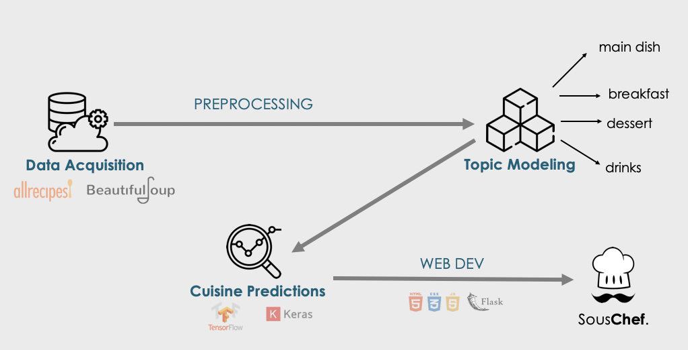

# SousChef - Personalized Recipes at Your Fingertips.

 
 

> Mariam Javed   
weblink: https://souschef-ai.herokuapp.com/

## Problem statement

We all live busy lives! From work to chores to other responsibilities, we all have a lot on our plate (no pun intended). For this reason, [SousChef](https://souschef-ai.herokuapp.com/) is here to make your life a little easier by recommending the **easiest** recipe for you given the ingredients you have on hand. 

This web app is for all of those that want to spice things up in the kitchen, discover some new flavours, chop their time in half, and bite right into recipes that are new and delicous!

## Objectives

Build a personalized recipe recommender by:

 - Collecting recipes (text data) by web scraping All Recipes and preforming topic modelling analysis for recipe-tagging (comparing LDA vs NMF) (ie. clustering them into different meal types: breakfast/lunch/dinner/appetizer/dessert)
 - Predicting the category of a dish's cuisine given a list of ingredients (Kaggle dataset) and building a Neural Network classification model 
 - Predict the cuisine for a user's ingredients and recommend a recipe that will be the quickest to make!
 - Deploy as a web app using Flask
 
## Web App

SousChef can be accessed via the following web link:

https://souschef-ai.herokuapp.com/
 
 
## Project Workflow

## Executive summary

The goal for [SousChef](https://souschef-ai.herokuapp.com/) is to recommend personalised, **quick** recipes to the user based on the ingredients the user has on hand.

In order to do this, I webscraped 5000+ recipes and ingredient from [AllRecipes](https://www.allrecipes.com/) (using BeautifulSoup) which formed the recipe database. These webscraped recipes did not have any meal types (ie. dinner/breakfast/dessert) tags associated with them so I used NMF topic modelling to classify the recipes as:

- main dish
- breakfast
- dessert      
- drinks 

Furthermore, I used the [What's Cooking](https://www.kaggle.com/c/whats-cooking) Kaggle dataset to develop my cuisine predictions which I did using a neural network model. Using purely just the ingredients, I was able to train and test a model that predicted what type of cuisine a set of ingredients belonged to with 85% and 80% train and test accuracy respectively. This model, was then used to predict the cuisines for my original All Recipes dataset to result in 20 different cuisines:

- Greek
- Southern_us
- Filipino
- Indian
- Jamaican
- Spanish
- Italian
- Mexican
- Chinese
- British
- Thai
- Vietnamese
- Cajun_creole
- Brazilian
- French
- Japanese
- Irish
- Korean
- Moroccan
- Russian

Finally, based on the user inputted ingredients, [SousChef](https://souschef-ai.herokuapp.com/) finds the intersection at which the ingredients are used in the recipe database, and outputs the name, cuisine type, ingredients and instructions for the recommended recipe.

## Project notebooks

The coding efforts are divided into five notebooks:

Part 1: Data Collection 

Part 2: Topic Modelling

Part 3: Predicting Cuisines

Part 4: End to End Pipeline - Recommendation

## Next Steps

- Web scrape recipe links along with the recipe information so [SousChef](https://souschef-ai.herokuapp.com/) can output where the user can find the recipe.
- Expand on the user ingredient inputs; ingredient intersection
- Recommend what additional ingredients user needs in order to make the recipe
- Expand on database to include recipes from Yummly, Epicurious etc.

## Future Application

- Integrate with grocery apps, such as Instacart, to retrieve shopping cart ingredients and recommend recipes based on user items.

## Attributions

- [Ryan Lee](https://github.com/rtlee9/recipe-scraper/tree/4f3d38c1b99acff43410f9d72118f4a4fc87eefa)
- [Jhonsen Djajamuliadi](https://github.com/jhonsen/Produce2Recipe)

